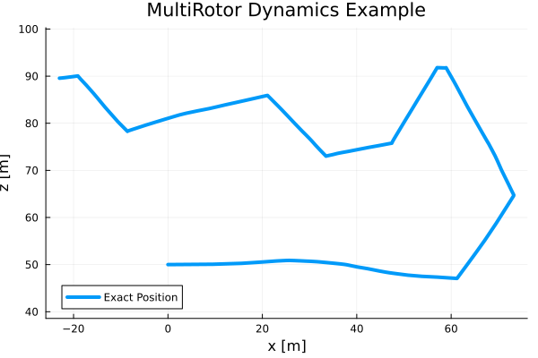

This project relies on generative dynamics models to give paths for estimation, and estimate trajectories. The models can include any type of noise, be deterministic, or even have discrete switches in dynamics. We embraced the saying 'All models are wrong, but some models are useful' and focused on the resulting behavior of the models rather than coding up realistic physics and aerodynamics. The models in this section are used for both generating paths and inside the estimators. 

# Generative Dynamics models.
There are 2 main dynamics models, the object models which include physical objects moving in space, and the measurement models which give measurement behavior for tracking objects. 

## Object Models
### Fixed Wing 
The goal of the fixed wing model is to generate a smooth trajectory that has maneuvers in it. It should look like a plausible trajectory for a fixed wing aircraft. This means no sudden turns, the velocity should always stay above some value $v_{min}$, and it should look like it is gliding. Most importantly, it should have some random noise included into the model to make the resulting trajectory interesting. This can be accomplished many ways, some of which are described bellow. 

#### Dubins lite
This method takes inspiration from dubins aircraft model, but makes some simplifications to make it more intuitive. 

$$
x = 
\begin{bmatrix}
x \\
z \\
\alpha \\
v \\
\omega
\end{bmatrix}
=
\begin{bmatrix}
\text{x position} \\
\text{y position} \\
\text{Attitude angle from horizontal} \\
\text{Velocity} \\
\text{Angular Velocity}
\end{bmatrix}
$$

$$
\dot{x} = 
\begin{bmatrix}
v \cos{\alpha} \\
v \sin{\alpha} \\
0\\
-\frac{1}{2}v^2 \rho Cd \\
0 
\end{bmatrix}
+
\omega
+
u
$$
Where $\omega$ is the noise vector and $u$ is the control vector.

$$
u = 
\begin{bmatrix}
0 \\
0 \\
d\alpha \\
dv \\
0
\end{bmatrix}
$$

The model controls the $\alpha$ rate instead of $\omega$ rate because if omega is controlled then a control law is needed to make it stable and the trajectories were less like a real aircraft. 

This is a non-linear model that must be integrated using some numeric integrator. We use RK45 for this purpose. The control vector and noise vector are fixed for each $k$ to $k+1$ allowing for easier integration and control of the aircraft. 

The control vector is generated randomly each time step from the following distribution. Although this is not how a pilot would think about controlling an aircraft (they have a goal in mind and are smooth on controls execution), it still gives reasonably interesting trajectories to analyze. 

$$
u = 
\begin{bmatrix}
0 \\
0 \\
\mathcal{N}(0, 3.0) \text{deg} \\
\mathcal{N}(1, 3.0) \text{m/s} \\
0
\end{bmatrix}
$$

This model generates pseudorandom trajectories, one of which is:

This is a realistic looking aircraft trajectory with the pilot ascending up and then curving down. The specific parameters may be tuned to give slightly different behavior, but the general shapes of the trajectories generated will stay the same. 

#### Process Noise (w)
The process noise mainly takes into account wind effects. To keep the model simple, the wind affects the rate of change in x and z states. The wind is modeled as colored noise because the wind changes directions slowly and is not white. More specific, its model as a first order autoregressive function that is slightly damped:
$$w_{k+1} = 0.9w_k+\begin{bmatrix}\mathcal{N}(0, 0.5)\\ \mathcal{N}(0, 0.5)\end{bmatrix}$$
An example generation of wind noise is as follows: 

Note: The wind is held constant for a time step and since it is added to $\dot{x}$ and $\dot{z}$, is present in the integration step.

### Multirotor - Dubins lite
The goal of the Multirotor model is to generate a smooth trajectory that has general maneuvers in it, and some multirotor specific maneuvers. It should look like a plausible trajectory for a multirotor aircraft. This trajectory should look similar to the fixed wing model for most of the time, but should allow for occasional sharp turns, and lowering the velocity to zero.

This is accomplished by using the same model as the Fixed Wing Dubins Lite model, but without a velocity restriction and with a different control input PDF. This control PDF has a small amount of probability density at high $d\alpha$ so that about 1-5% of the time it takes a sharp turn. 

$$
u = 
\begin{bmatrix}
0 \\
0 \\
0.98\mathcal{N}(0, 3.0) +  0.01\mathcal{N}(90, 1.0) + 0.01\mathcal{N}(-90, 1.0) \hspace{1cm} \text{[deg/s]} \\
\mathcal{N}(1, 3.0) \hspace{1cm} \text{[m/s/s]} \\
0
\end{bmatrix}
$$

This returns the following pseudorandom trajectories. 

This is different enough from the fixed wing model to allow for identification between the systems while also making them similar enough to be different. 

## Measurement Models

### Radar

The radar system is approximated to measure the elevation $e$, range $r$, and range velocity $\dot{r}$ of the object's center of mass with respect to the radars' location $p_{r} = x_r, z_r$. This avoids the complexity of point clouds and centroiding that more accurate radar models would have. A more complex radar model that includes characterizations like surface area, and rotor speed would be useful for characterization, but add too much complexity at this time. The model also includes noise $\mathcal{v}$ to model sensor noise and environmental noise. The following is the model

$$
y = 
\begin{bmatrix}
e \\
r\\
\dot{r}
\end{bmatrix}
=
\begin{bmatrix}
\text{Elevation} \\
\text{Distance From Radar}\\
\text{Relative Velocity From Radar. }
\end{bmatrix}
= 
\begin{bmatrix}
\tan^{-1}{\frac{z-z_r}{x-x_r}} \\
\sqrt{(x-x_r)^2+(z-z_r)^2}\\
v \cos{\alpha - \tan^{-1}{\frac{z-z_r}{x-x_r}}}
\end{bmatrix}
+
\mathcal{v}
$$

The measurement noise $\mathcal{v}$ is designed to realistic model radar noise without getting too low level. The elevation noise captures sensor uncertainty in its angle, so it is a normal distribution centered around zero. The range noise captures the environmental noise from air density uncertainties and multipathing. These errors cause the signal to return to the radar slower than expected, which means that the object's measured distance will be too large. The noise is a Chi Squared distribution, so it is always positive. Finally, the velocity is a normal distribution to take into account doppler errors. 

$$
\mathcal{v} = 

\begin{bmatrix}
\mathcal{N}(0, 2) \text{[deg]} \\
\text{ChiSq}(1) \text{[m]} \\
\mathcal{N}(0, 0.2) \text{[m/s]}
\end{bmatrix}
$$

This creates the following example measurements:

This is not perfect to real life and a good improvement is to have the noise depend on the state of the object. Have the elevation noise increase with the distance away, and have the distance noise increase with distance. This may be incorporated in the future, but the code is currently made for static distributions. 

